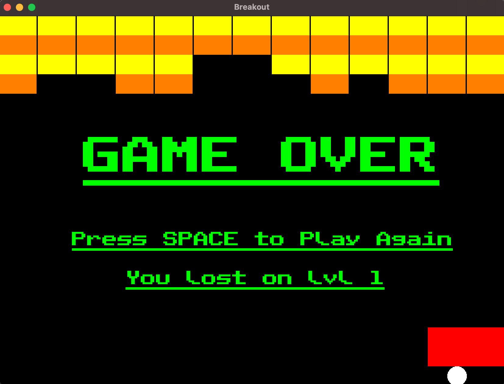

# Breakout
This C++ project is a clone of Breakout, made using the SFML Engine(https://www.sfml-dev.org).



## How to build

```
$ make all

$ ./breakout
```

## Credits

The font used for the game over text and the sound effect is not by me:

- The font is called "Public Pixel Font," and it is created by GGBotNet (https://www.fontspace.com/public-pixel-font-f72305).
- The sound effect used was made by captaincrunch80 (https://opengameart.org/content/3-ping-pong-sounds-8-bit-style).
